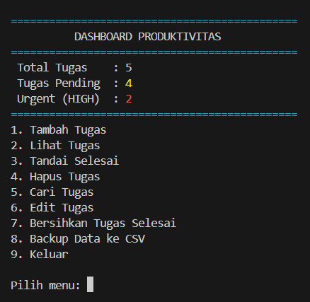
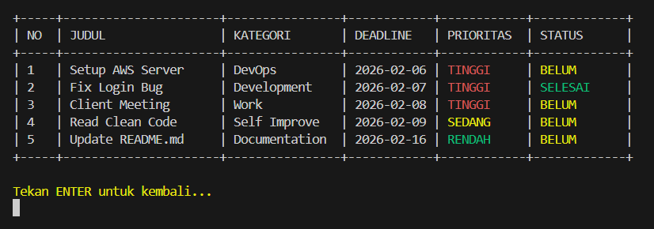

# Daily Planner

[](https://www.oracle.com/java/)
[](LICENSE)
[](https://www.sqlite.org/)

**Daily Planner** adalah solusi manajemen tugas berbasis *command-line interface* (CLI) yang dikembangkan menggunakan Java. Aplikasi ini dirancang untuk mengoptimalkan produktivitas harian melalui manajemen tugas yang komprehensif, sistem prioritas berbasis visual, dan persistensi data yang andal.

<p align="center">
  
</p>

## 🚀 Fitur Utama

* **Real-time Productivity Dashboard:** Visualisasi instan terhadap total tugas, status tertunda, dan tugas dengan urgensi tinggi.
* **Comprehensive Task Management (CRUD):** Implementasi lengkap pembuatan, pembacaan, pembaruan, dan penghapusan data tugas.

    > **Tampilan Daftar Tugas:**
    > 

* **Data Persistence with SQLite:** Integrasi *database* relasional untuk menjamin integritas dan keamanan data saat aplikasi ditutup.
* **Intelligent Input Validation:** Sistem proteksi berbasis aturan untuk memastikan akurasi format tanggal (ISO 8601) dan validitas waktu *deadline*.
* **ANSI-based Visual Priority:** Indikator visual dinamis (Merah/Kuning/Hijau) untuk diferensiasi tingkat urgensi tugas secara cepat.
* **Search & Dynamic Filtering:** Mesin pencari berbasis kata kunci serta filter modular berdasarkan status penyelesaian dan level prioritas.
* **Data Export (CSV):** Fitur ekspor data ke format CSV yang kompatibel dengan Microsoft Excel untuk keperluan pelaporan eksternal.

## 🛠️ Arsitektur & Teknologi

Proyek ini mengimplementasikan prinsip **Separation of Concerns** dengan struktur yang modular:

| Komponen | Deskripsi |
| :--- | :--- |
| **Bahasa Pemrograman** | Java (JDK 11+) |
| **Database** | SQLite (Lightweight Relational Database) |
| **Driver** | JDBC (Java Database Connectivity) |
| **Design Pattern** | Model-View-Controller (MVC) Approach |

### Struktur File
* `Main.java`: Bertanggung jawab atas *User Interface* (UI) dan alur navigasi aplikasi (View).
* `TaskService.java`: Layer logika bisnis dan orkestrasi operasi *database* (Controller).
* `Task.java`: Representasi entitas data tugas (Model).
* `DatabaseConfig.java`: Konfigurasi koneksi JDBC dan inisialisasi skema *database*.
* `Priority.java`: Definisi tipe data enumerasi untuk manajemen urgensi.

## ⚙️ Instalasi dan Pengoperasian

### Prasyarat
1. **Java Development Kit (JDK)** 11 atau versi terbaru.
2. **SQLite JDBC Driver** (file `.jar`).
   * [Download Driver di sini (Maven Repository)](https://repo1.maven.org/maven2/org/xerial/sqlite-jdbc/3.46.0.0/sqlite-jdbc-3.46.0.0.jar)
   * *Catatan: Letakkan file `.jar` driver di dalam folder proyek yang sama dengan kode program.*

### Instruksi Menjalankan Aplikasi

Buka terminal atau CMD di dalam folder proyek, lalu jalankan perintah berikut sesuai sistem operasi Anda:

#### **Windows (Command Prompt / PowerShell)**
```bash
# Kompilasi seluruh modul
javac -cp ".;sqlite-jdbc-3.46.0.0.jar" *.java

# Eksekusi aplikasi
java -cp ".;sqlite-jdbc-3.46.0.0.jar" Main
```

#### **Linux & macOS (Terminal)**
```bash
# Kompilasi seluruh modul (Gunakan titik dua ':' sebagai separator)
javac -cp ".:sqlite-jdbc-3.46.0.0.jar" *.java

# Eksekusi aplikasi
java -cp ".:sqlite-jdbc-3.46.0.0.jar" Main
#(Pastikan nama file jar sesuai dengan versi yang Anda unduh, contoh di atas menggunakan versi 3.46.0.0) 
```

**📄 Lisensi**
Didistribusikan di bawah MIT License. Lihat file LICENSE untuk informasi lebih lanjut.

**👨‍💻 Author**
Jika ada pertanyaan, saran, atau ingin berdiskusi mengenai proyek ini, silakan hubungi saya:

Angga Mahardhika Kurniawan

* **Email:** anggamahardhika06@gmail.com
* **LinkedIn:** [Angga Mahardhika](https://www.linkedin.com/in/angga-mahardhika-kurniawan-637016382)
* **GitHub:** [anggo-coder](https://github.com/anggo-coder)
* **Project Repository:** [Daily-Planner](https://github.com/anggo-coder/Daily-Planner)

If you find this project helpful, please consider giving it a ⭐ to support the development.